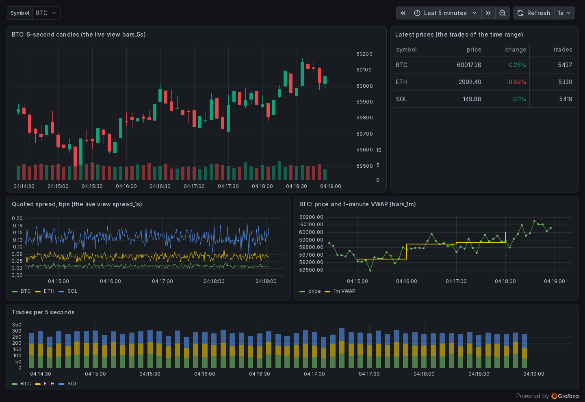

# A live market dashboard

One command runs market data through brrrrr into Grafana: a feed of trades and quotes on Kafka,
`brrrrr serve` ingesting them into live tables, live views that keep bars and spreads up to date
as rows arrive, and a Grafana dashboard that queries them every second over the PostgreSQL
protocol.

```sh
docker compose up
```

Then open **http://localhost:3000**: the dashboard, no login needed. brrrrr's own console is at
**http://localhost:4242**, where the same tables and live views can be queried and streamed.



## What runs

| Service | What it does |
| --- | --- |
| `redpanda` | Kafka (Redpanda in dev mode), with the topics `trades` and `quotes`. |
| `feed` | [`feed.sh`](feed.sh): a random walk of BTC, ETH and SOL, a quote of each every 100 ms and about 60 trades a second, as JSON, produced with `rpk`. |
| `brrrrr` | `brrrrr serve --kafka redpanda:9092 --ingest trades=trades --ingest quotes=quotes`: each topic into a live table, kept in memory and flushed to Parquet by day. |
| `views` | Creates the live views of [`views.sql`](views.sql) once the tables exist: 5-second and 1-minute bars with VWAP, and the spread each second. |
| `grafana` | A PostgreSQL data source pointing at brrrrr and the dashboard [`market.json`](grafana/dashboards/market.json), provisioned. |

A live view is a query brrrrr runs as rows arrive; what it emits is a table of its own, so the
dashboard's queries are small:

```sql
CREATE OR REPLACE LIVE VIEW bars_5s AS
SELECT time_bucket('5s', ts) AS bucket, symbol,
       first(price, ts) AS open, max(price) AS high, min(price) AS low, last(price, ts) AS close,
       sum(size) AS volume, count(*) AS trades
FROM trades GROUP BY bucket, symbol;
```

```sql
-- the candles panel
SELECT bucket AS time, open, high, low, close, volume
FROM bars_5s
WHERE symbol = '$symbol' AND $__timeFilter(bucket)
ORDER BY bucket
```

## Make it yours

- **Your own feed:** point `--kafka` and `--ingest TABLE=TOPIC` at your topics, one JSON object
  per message with a time (ISO 8601 text) among its fields, and drop the `feed` service.
- **More views:** add them to `views.sql`; the [SQL reference](https://aperiodic-io.github.io/monotile/docs/sql.html)
  and the [cookbook](https://aperiodic-io.github.io/monotile/docs/cookbook.html) have the
  building blocks (VWAP, as-of joins with quotes, markouts, rolling windows).
- **This repository's build** instead of the published image: `BRRRRR_IMAGE=brrrrr:dev` after
  `docker build --build-arg CARGO_ARGS= -t brrrrr:dev ../..`, or uncomment `build:` in
  [`docker-compose.yml`](docker-compose.yml).

`docker compose down -v` stops it and deletes its data.
